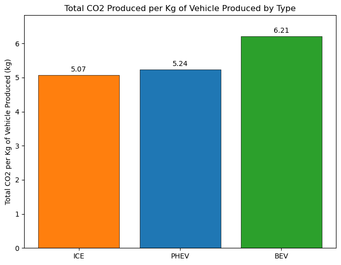
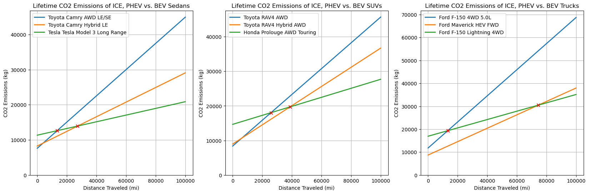
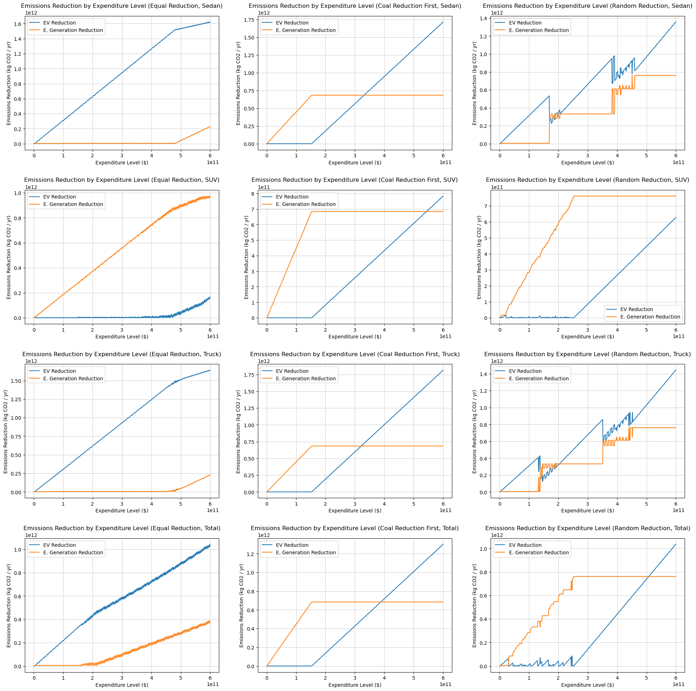
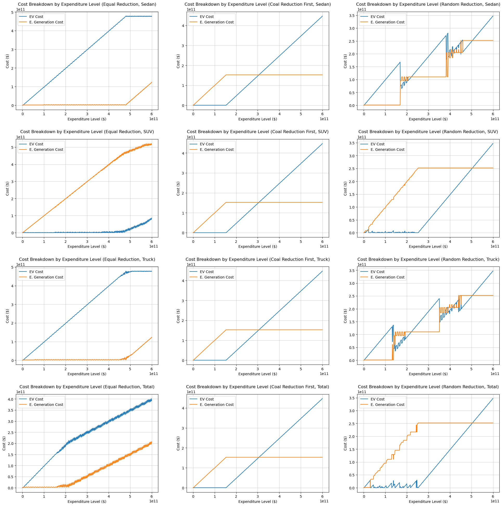

# Optimizing Fund Allocation for Emissions Reduction

## Overview

This project examines how a fixed level of government funding could be allocated between **electric vehicle (EV) subsidies and renewable energy investment** to maximize reductions in carbon emissions.

The analysis considers emissions across both the transportation and electricity-generation sectors, including vehicle manufacturing and operation, vehicle lifespans, electricity-grid composition, renewable energy costs, and the subsidies required to encourage EV adoption.

This was completed as a **semester-long team project for Northeastern University's Applied Mathematics Capstone (MATH 4025)**. I was one member of the project team, and this repository contains code, data, calculations, visualizations, and final deliverables developed collaboratively throughout the project.

## Research Question

**For a given level of government expenditure, what allocation of funding between EV adoption and renewable electricity generation produces the greatest modeled reduction in carbon emissions?**

## Analytical Approach

The project combines several components into a single optimization framework:

- Estimated manufacturing and operating emissions for ICE, hybrid, and battery-electric vehicles
- Modeled vehicle lifespans using Weibull distributions
- Estimated lifetime and annualized vehicle emissions
- Calculated subsidy levels required to incentivize EV adoption
- Estimated electricity-generation costs for natural gas, wind, and solar
- Modeled alternative electricity-grid compositions
- Constructed cost and CO₂-reduction matrices representing different combinations of EV adoption and electricity-generation investment
- Optimized the allocation of a fixed government budget across the two investment categories

## Vehicle Emissions Analysis

Although electric vehicles can generate greater emissions during manufacturing, their lower operating emissions can offset this initial difference over the vehicle's lifetime.

### Production Emissions by Vehicle Type

### Lifetime Emissions by Vehicle Class

The analysis compared representative sedans, SUVs, and trucks across internal combustion, hybrid, and battery-electric vehicle types.

## Vehicle Lifespan Modeling

Vehicle lifespan was incorporated using **Weibull probability distributions**, allowing lifetime emissions to account for differences in expected vehicle longevity rather than assuming identical lifespans across vehicle types.

The resulting lifespan estimates were combined with manufacturing and operating emissions to estimate annualized emissions across vehicle categories.

### Yearly Emissions by Lifespan

## Optimization Model

The final stage of the project combined the transportation and electricity-generation analyses.

For each potential combination of EV subsidies and changes to electricity generation, the model constructed:

- A **cost matrix** representing total government expenditure
- An **emissions-reduction matrix** representing the associated reduction in CO₂

Combinations exceeding a specified government budget were removed, and the remaining feasible combinations were evaluated to identify the allocation associated with the greatest modeled emissions reduction.

Multiple scenarios were evaluated based on different assumptions about how fossil-fuel generation could be phased out.

### Emissions Reduction by Expenditure

### Cost Allocation by Expenditure

## Key Findings

The optimal allocation was highly dependent on both the available budget and assumptions about changes to the electricity grid.

Under the project's flagship scenario:

- At relatively **low expenditure levels**, the model favored greater investment in EV adoption.
- At **intermediate expenditure levels**, renewable electricity generation received the majority of modeled funding.
- At very **high expenditure levels**, the optimal allocation shifted back toward greater EV investment.
- The results demonstrate that the most effective modeled emissions-reduction strategy was not a fixed allocation between transportation and electricity generation, but changed as the available budget increased.

These results depend on the assumptions and datasets used in the model and should be interpreted as a quantitative scenario analysis rather than a policy prescription.

## Repository Contents

- `optimizer.py` — budget optimization framework
- `Code.ipynb` — project analysis notebook
- `capstone_project.ipynb` — supporting project analysis
- `final-report.pdf` — complete capstone report, methodology, results, and references
- `final-presentation.pptx` — final team presentation
- Supporting CSV and Excel files — source data, calculations, and intermediate analytical inputs
- PNG files — selected project visualizations

## Tools & Methods

**Python** | **Pandas** | **NumPy** | **Matplotlib** | Jupyter Notebook | Numerical Optimization | Matrix Modeling | Weibull Distributions | Scenario Analysis | Financial & Emissions Modeling
